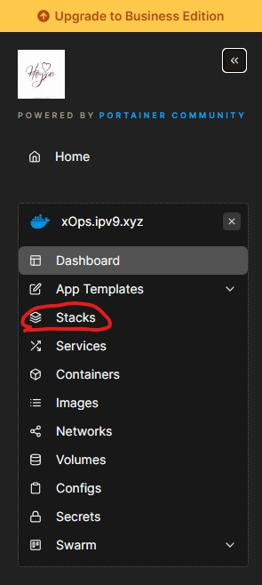
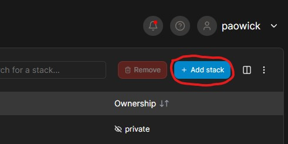
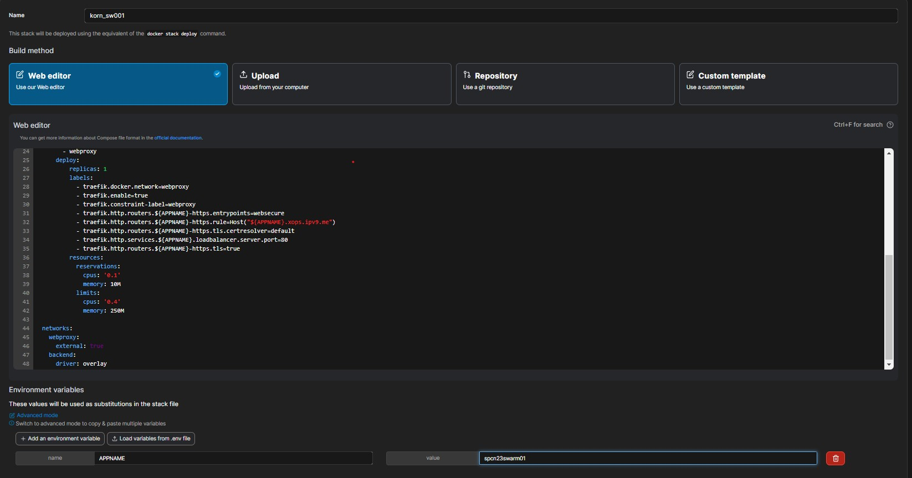
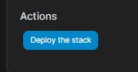
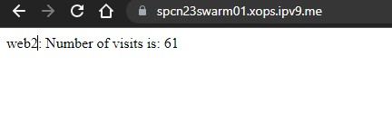

# swarm01

## REF
This repo reference from ***https://github.com/docker/awesome-compose/tree/master/nginx-nodejs-redis***
## Waka time
***https://wakatime.com/@spcn23/projects/paczceljwi***
## Result url 
***https://spcn23swarm01.xops.ipv9.me/***

Project structure:
```
.
├── README.md
├── docker-compose.yaml
├── nginx
│   ├── Dockerfile
│   └── nginx.conf
└── web
    ├── Dockerfile
    ├── package.json
    └── server.js
```
[_docker-compose.yaml_](docker-compose.yaml)
```

version: '3'
services:
  redis:
    image: 'redislabs/redismod'
    networks:
      - backendq
  web1:
    image: 'paowick/swarm01_web:1.1'
    hostname: web1
    networks:
      - backend
  web2:
    image: 'paowick/swarm01_web:1.1'
    hostname: web2
    networks:
      - backend
  nginx:
    image: 'paowick/swarm01_nginx:1.1'
    depends_on:
    - web1
    - web2
    networks:
      - backend
      - webproxy
    deploy:
        replicas: 1
        labels:
          - traefik.docker.network=webproxy
          - traefik.enable=true
          - traefik.constraint-label=webproxy
          - traefik.http.routers.${APPNAME}-https.entrypoints=websecure
          - traefik.http.routers.${APPNAME}-https.rule=Host("${APPNAME}.xops.ipv9.me")
          - traefik.http.routers.${APPNAME}-https.tls.certresolver=default
          - traefik.http.services.${APPNAME}.loadbalancer.server.port=80
          - traefik.http.routers.${APPNAME}-https.tls=true
        resources:
          reservations:
            cpus: '0.1'
            memory: 10M
          limits:
            cpus: '0.4'
            memory: 250M

networks:
  webproxy:
    external: true
  backend:
    driver: overlay
```
## Step

#### Step 1

&emsp; build image form Dockerfile and push to **Docker Hub**
```
.
├── README.md
├── docker-compose.yaml
├── nginx
│   ├── Dockerfile  <--- here
│   └── nginx.conf
└── web
    ├──Dockerfile   <--- here
    ├── package.json
    └── server.js
```
&emsp; Dockerfile for build **nginx** image [_here_](/nginx/Dockerfile)
```
# pull image from nginx version 1.21.6 on docker hub 
FROM nginx:1.21.6
# execute command for remove old config
RUN rm /etc/nginx/conf.d/default.conf
# copy new config to image
COPY nginx.conf /etc/nginx/conf.d/default.conf
```
&emsp; build **nginx** image
```
$docker build ./nginx -t paowick/swarm01_nginx:1.1
```
&emsp; before push the image must be login docker account first ``` $docker login ```\
&emsp; push image to **Docker Hub**
```
$docker push paowick/swarm01_nginx:1.1
```
&emsp; Dockerfile for build **node js web** image [_here_](/web/Dockerfile)
```
# pull image from node version 14.17.3 alpine on docker hub 
FROM node:14.17.3-alpine3.14
# set work directory at /usr/src/app
WORKDIR /usr/src/app
# copy package.json and package-lock.json to image
COPY package.json package-lock.json ./
# execute command for install node_modules
RUN npm i -y
# copy server.js to image 
COPY ./server.js ./
# execute command for start application
CMD ["npm","start"]

```
&emsp; build **node** js web image
```
$docker build ./web -t paowick/swarm01_web:1.1
```
&emsp; before push the image must be login docker account first ``` $docker login ```\
&emsp; push image to **Docker Hub**
```
$docker push paowick/swarm01_web:1.1
```

#### Step 2
&emsp; Config docker-compose for support traefix and pull image from docker hub\
&emsp; replace ```image: 'paowick/swarm01_web:1.1'``` to service
```
  web1:
    image: 'paowick/swarm01_web:1.1'   <--- here
    hostname: web1
    networks:
      - backend
  web2:
    image: 'paowick/swarm01_web:1.1'   <--- here
    hostname: web2
    networks:
      - backend
```
&emsp; replace ```image: 'paowick/swarm01_nginx:1.1'``` to service
```
  nginx:
    image: 'paowick/swarm01_nginx:1.1'   <--- here
    depends_on:
    - web1
    - web2
    networks: 
```
&emsp; config label revert Proxy (traefix) reference from [_here_](https://github.com/pitimon/Hello0910/blob/main/docker-compose.yml)\
&emsp; must be look like this
```
  nginx:
    image: 'paowick/swarm01_nginx:1.1'
    depends_on:
    - web1
    - web2
    networks:
      - backend
      - webproxy
    deploy:
        replicas: 1
        labels:
          - traefik.docker.network=webproxy
          - traefik.enable=true
          - traefik.constraint-label=webproxy
          - traefik.http.routers.${APPNAME}-https.entrypoints=websecure
          - traefik.http.routers.${APPNAME}-https.rule=Host("${APPNAME}.xops.ipv9.me")
          - traefik.http.routers.${APPNAME}-https.tls.certresolver=default
          - traefik.http.services.${APPNAME}.loadbalancer.server.port=80
          - traefik.http.routers.${APPNAME}-https.tls=true
        resources:
          reservations:
            cpus: '0.1'
            memory: 10M
          limits:
            cpus: '0.4'
            memory: 250M

networks:
  webproxy:
    external: true
  backend:
    driver: overlay
```
#### Step 3
&emsp; Deploy to https://portainer.ipv9.me/\
- open [_portainer_](https://portainer.ipv9.me/) select **Stack menu**  \

- select Add Stack

- Copy Scripts inside [_docker-compose.yaml_](docker-compose.yaml) file insert them in Web editor Text box Entry Stack name and set your enviroment variable "APPNAME" or you can change by yourself in scripts

- and then deploy


# Result 
&emsp; Url after deploy https://spcn23swarm01.xops.ipv9.me/\

&emsp; On every refash a page the number of visits was ***keep increasing*** 
&emsp; And web will change between <u>web1</u> and <u>web2</u> because it's a ***load balancer***